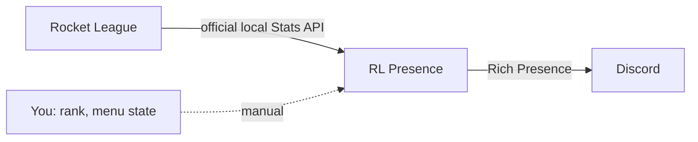

<div align="center">


# RL Presence

**Show your Rocket League match on Discord — live score, map, mode and time.**

Built on the official Stats API. No memory reading, no game commands.

[](https://github.com/schwairex/RocketLeague-Presence/releases)


[](LICENSE)

[**Download**](https://github.com/schwairex/RocketLeague-Presence/releases) ·
[Features](#features) ·
[Quick start](#quick-start) ·
[FAQ](#faq) ·
[Türkçe](README.tr.md)

<br>


</div>

<br>

## Features

- **Live match card** — map, game mode, score and a real countdown, updated as you play.
- **Rank on your profile** — pick your rank and division per ranked playlist (3v3, 2v2, 1v1, Heatseeker, Rumble, Hoops, Snow Day, Dropshot). The icon appears only in the matching playlist.
- **Menu and training states** — main menu, queue, shop, garage, free play and custom training, selectable by you.
- **Zero-setup Stats API** — scans every Steam library and Epic install, enables the Stats API for you and keeps a `.bak` backup of the ini.
- **Replay and overtime aware** — goal replays, pauses, overtime, match end and history replays are handled separately.
- **Looks the part** — modern dark UI, Turkish and English, resizable window.
- **Self-updating** — checks GitHub Releases on launch, verifies the SHA-256 and rolls back if the new version fails to start.
- **Built-in diagnostics** — one click to open logs or save a diagnostics report.

## Screenshots

<table>
  <tr>
    <td align="center"><br><sub><b>Display</b> — choose what Discord shows</sub></td>
    <td align="center"><br><sub><b>General</b> — Stats API, rank, player</sub></td>
  </tr>
  <tr>
    <td align="center"><br><sub><b>Updates</b> — one-click updates</sub></td>
    <td align="center"><br><sub><b>About</b> — how it works</sub></td>
  </tr>
</table>

## Quick start

**You need:** Windows 10/11 · Discord **desktop** app · Rocket League (Steam or Epic) · Microsoft Edge WebView2 Runtime

1. Download `rl-presence.exe` from [Releases](https://github.com/schwairex/RocketLeague-Presence/releases) and put it in a writable folder (config and logs are created next to it).
2. Start it. On first launch it finds your Rocket League install and enables the Stats API.
3. **Fully quit and restart Rocket League once.** The API cannot be switched on inside a running game.
4. In **General**, set your rank and in **Display** your in-game name, then press **Save**.
5. Play a match. Your Discord profile updates by itself.

> [!TIP]
> Keep Discord's activity sharing enabled (*Settings → Activity Privacy*) and use the desktop app, not the browser.

## How it works



RL Presence only **listens** to the local Stats API that Psyonix provides. It never reads game memory and never sends commands to the game.

| Shown automatically | Chosen by you |
| --- | --- |
| Map, mode, score, time, overtime | Rank and division |
| Goal replay, pause, match end | Main menu, queue, shop, garage |
| Your team and personal stats | Training and custom training |

The official API provides neither rank nor detailed menu state, which is why those two are manual.

## FAQ

<details>
<summary><b>Is it safe to use?</b></summary>

It uses only the official Stats API and never touches game memory. It is an independent community project and is not affiliated with Epic Games or Psyonix, so use it at your own discretion.
</details>

<details>
<summary><b>Nothing shows on Discord.</b></summary>

1. Rocket League must be **fully restarted** after the first launch of the app.
2. Use the Discord **desktop** app and make sure activity sharing is on.
3. Run Discord and RL Presence at the same privilege level (both normal or both admin).
4. Check the status dots at the top of the window, then open **General → Diagnostics**.
</details>

<details>
<summary><b>The timer keeps running during a goal replay.</b></summary>

Discord's native timer cannot be paused, it only supports start and end timestamps. The countdown is corrected at the next kickoff.
</details>

<details>
<summary><b>Why isn't my rank detected automatically?</b></summary>

The official Stats API does not expose rank. Pick it once per playlist in **General**.
</details>

<details>
<summary><b>What does the bug report button send?</b></summary>

Only the title and description you type, the app version and your OS. No logs, accounts, passwords or tokens are attached.
</details>

## Run from source

```powershell
python -m venv .venv
.\.venv\Scripts\python.exe -m pip install -r requirements.txt
.\.venv\Scripts\python.exe run.py
```

Debug runs: `run.py --debug --raw-packets`. Build the EXE with `.\build.ps1`.
More: [Configuration](docs/CONFIGURATION.md) · [Troubleshooting](docs/TROUBLESHOOTING.md) · [Development](docs/DEVELOPMENT.md) · [Art assets](ART_ASSETS.md) · [Releasing](RELEASING.md) · [Changelog](CHANGELOG.md)

## Credits

Data from the [Rocket League Stats API](https://www.rocketleague.com/developer/stats-api). Architecture ideas from [Its-Haze/league-rpc](https://github.com/Its-Haze/league-rpc) and [Katlicia/LOLCustomRPC](https://github.com/Katlicia/LOLCustomRPC); no League-specific code was used.

<sub>Rocket League® is a trademark of Psyonix LLC. RL Presence is an unofficial fan project. Released under the [MIT License](LICENSE).</sub>
