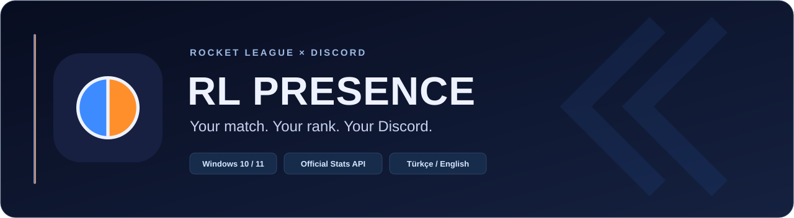
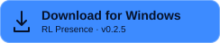
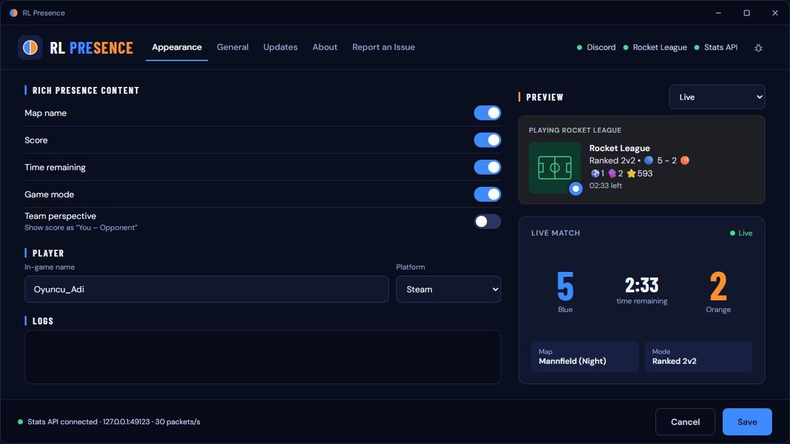
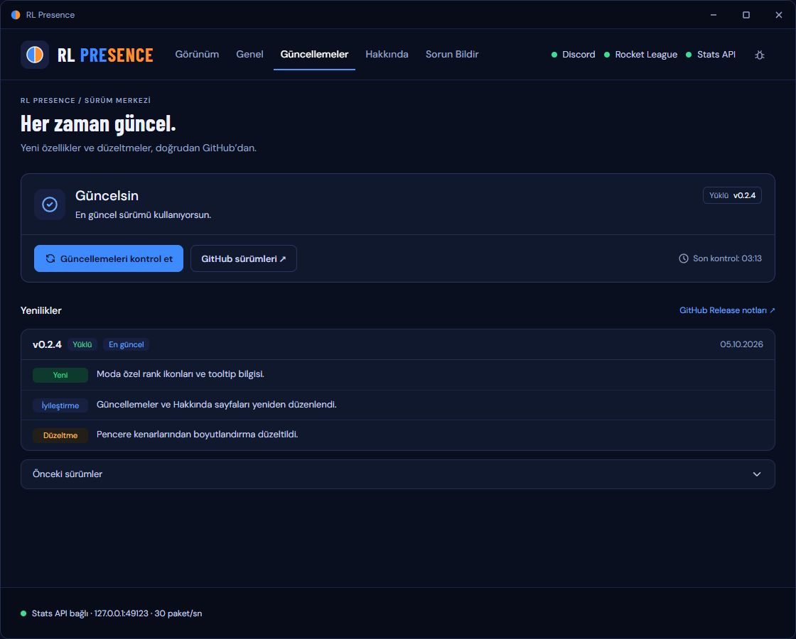
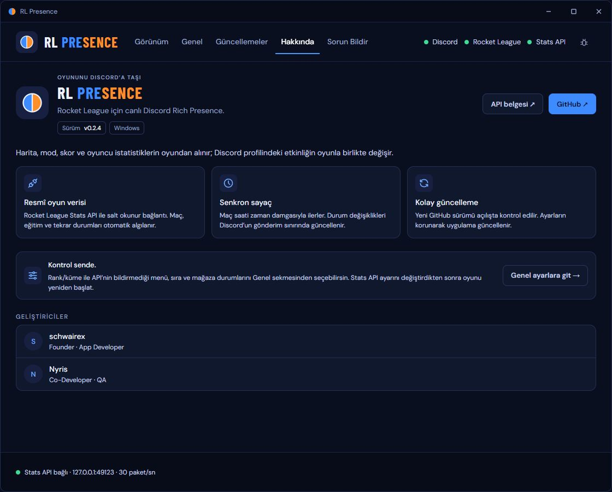

<p align="center">
  
</p>

<p align="center">
  Bring your Rocket League session to Discord.<br>
  <strong>Live match details, map artwork and your selected rank — in one clean activity card.</strong>
</p>

<p align="center">
  <a href="https://github.com/schwairex/RocketLeague-Presence/releases/latest/download/rl-presence.exe"></a>
</p>

<p align="center">
  <a href="README.tr.md">Türkçe</a> ·
  <a href="#getting-started">Getting started</a> ·
  <a href="https://github.com/schwairex/RocketLeague-Presence/releases">Release notes</a> ·
  <a href="docs/usage.md">Full guide</a>
</p>

---

## Your game, at a glance

RL Presence is a Windows companion that reads Rocket League's **official local Stats API** and updates Discord Rich Presence. It follows the game, keeps your match information together, and reconnects when Rocket League or Discord restarts.

<p align="center">
  
</p>

<p align="center"><sub>The desktop interface with sample match data. Discord artwork requires the application's uploaded assets.</sub></p>

| Made for your match | Made for everyday use |
| --- | --- |
| **Live match context** — mode, arena, Blue/Orange score and result. | **Automatic setup** — discovers Steam and Epic installations and enables the Stats API. |
| **A synchronized clock** — live countdown during play, hidden while the game clock is stopped. | **Two languages** — switch between Türkçe and English in General. |
| **Your own stats** — points, goals and saves after identifying your player. | **Verified updates** — startup release checks, SHA-256 verification and recovery on failed startup. |
| **Rank artwork** — a separate manual rank/division for each supported ranked mode. | **Built-in issue reports** — a localized form, without sending logs or account identifiers. |

## Getting started

### 1. Download and open

Download **`rl-presence.exe`** from [the latest release](https://github.com/schwairex/RocketLeague-Presence/releases/latest) and place it in a writable folder. Start the **Discord desktop app**, then launch RL Presence.

**Requirements:** Windows 10/11, Microsoft Edge WebView2 Runtime and .NET Framework 4.8. The EXE includes Python; you do not need a Python installation or your own Discord application.

### 2. Let the app configure Rocket League

The app scans Steam libraries and Epic manifests, configures the discovered installations and reports their status. With both launchers installed, the running game's executable selects the active installation.

**If the app changes the Stats API settings, fully close and reopen Rocket League.** The game only reads those settings at startup. If an installation cannot be found or written, the app explains the next step in General.

### 3. Make it yours

In **Appearance**, enter your Rocket League player name/platform to show your own stats. In **General**, choose your language and select a rank/division for each ranked mode. Save, start a match and keep RL Presence running.

> **Ranks are selected manually.** The official API does not provide rank, division or detailed menu/shop/queue state. You can choose those activities in General; live match data takes priority.

## A small icon. Your current rank.

Select independent ranks for **Ranked 1v1, 2v2, 3v3, Heatseeker, Rumble, Hoops, Snow Day and Dropshot**. The current ranked playlist uses its own selection.

- The **large image** is the arena; its tooltip shows the map name.
- The **small image** is your selected rank, with a tooltip such as **Diamond I Div IV**.
- Rank text stays out of the score and map lines. Casual, training, hidden rank and unranked selections have no small icon or tooltip.

The maintainer uploads artwork once to the fixed Discord application. End users do not upload images. [Exact map and rank asset keys →](docs/art-assets.md)

### Stats in focus with v0.2.6

**Rocket League**

```text
Ranked 2v2 • 🔵 5 - 2 🟠
⚽1  🧤2  ⭐593
```

⚽ goals · 🧤 saves · ⭐ points. Ranked and casual put only your stats on the second line; the map name stays in the large artwork tooltip. Casual uses its actual playlist name, without a small icon. Training shows **Training** and the map, without stats or small artwork. The native live timer stays during play, disappears while the game clock is stopped, and resumes at kickoff; no white/static time is added to the text. Personal stat changes publish as soon as Discord’s rolling budget permits. If a value is **—**, set your exact player name/platform in Appearance; unknown values are never guessed. [Clock and update limits →](docs/usage.md#match-clocks-and-rate-limiting)

## A desktop app that stays out of the way

<details>
<summary><strong>See the Updates and About pages</strong></summary>

### Clear updates

Release notes, download/verification progress and previous releases in one place.



### A familiar interface

The same dark theme throughout, with a resizable window and scrollable content.



Screenshots show the v0.2.4 interface with sample status data; release availability comes from GitHub at runtime.

</details>

## Need a hand?

| What you see | What to check |
| --- | --- |
| **“In menus / Queueing” throughout the match** | Open General and check installation/API status. Restart Rocket League after an INI change. |
| **Your own stats are missing** | Set your player name/platform. Clear a saved PrimaryId when switching accounts. |
| **Discord does not show the activity** | Keep desktop Discord open on the same Windows session and check activity sharing. |
| **A map or rank icon is missing** | The corresponding artwork must be uploaded by the Discord application's maintainer. |

For another problem, open **Report an Issue** in the app. Reports are public: do not include passwords or personal information. [Debugging and detailed setup →](docs/usage.md#debugging-and-test-match)

## Run from source

Python **3.11+** on Windows:

```powershell
python -m venv .venv
.\.venv\Scripts\python.exe -m pip install -r requirements.txt
.\.venv\Scripts\python.exe run.py
```

To test or build the single EXE:

```powershell
.\.venv\Scripts\python.exe -m pip install -r requirements-dev.txt
.\.venv\Scripts\python.exe -m pytest
.\build.ps1 -Python .\.venv\Scripts\python.exe
# Output: dist\rl-presence.exe
```

## A tidy repository

```text
RocketLeague-Presence/
├── assets/                 # Public logo, README graphics and screenshots
├── docs/                   # User guides, development, releases and asset keys
│   ├── licenses/           # Third-party font and icon notices
│   └── qa/                 # Verification records and historical captures
├── rocket_league_rpc/      # Python application modules
│   ├── ui/                 # Packaged desktop HTML, JS, translations and icons
│   └── tests/              # Unit and mock-server integration tests
├── run.py                  # Application entry point
├── build.ps1               # Windows single-file build
├── config.example.json     # Example settings; personal config stays local
├── requirements.txt
├── requirements-dev.txt
├── pyproject.toml
├── CHANGELOG.md
├── README.md
└── README.tr.md
```

Generated `dist/`, `build/`, `logs/`, `.venv/` and personal `config.json` are ignored. Downloads belong in **GitHub Releases**.

| Explore | Link |
| --- | --- |
| Setup, settings and API behavior | [English guide](docs/usage.md) · [Türkçe rehber](docs/usage.tr.md) |
| Development and module responsibilities | [Development guide](docs/development.md) |
| Release publishing and automatic updates | [Release guide](docs/releasing.md) |
| Uploading the README/logo to GitHub | [Türkçe yükleme rehberi](docs/github-upload.tr.md) |
| Discord map and rank artwork | [Asset list](docs/art-assets.md) · [Rank keys](docs/rank-asset-keys.txt) |
| Changes and validation | [Changelog](CHANGELOG.md) · [v0.2.6 verification](docs/qa/verification.md) |

## The people behind RL Presence

| Developer | Role |
| --- | --- |
| **[schwairex](https://github.com/schwairex)** | Founder · App Developer |
| **Nyris** | Co-Developer · QA |

Rocket League data comes from the [official Stats API](https://www.rocketleague.com/developer/stats-api). Playlist/map lookups are best effort; the full guide documents clock and identity limitations. Third-party notices: [fonts](docs/licenses/fonts.txt) · [icons](docs/licenses/icons.txt).

<p align="center"><sub>Like the project? A star helps other Rocket League players discover it.</sub></p>
