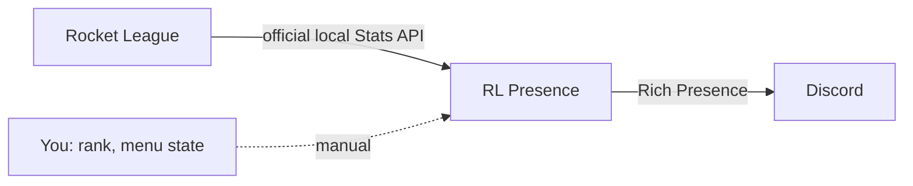

<<<<<<< HEAD
<p align="center">
  
</p>

<p align="center">
  Bring your Rocket League session to Discord.<br>
  <strong>Live match details, map artwork and your selected rank — in one clean activity card.</strong>
</p>

<p align="center">
  <a href="https://github.com/schwairex/RocketLeague-Presence/releases/latest/download/rl-presence.exe"></a>
</p>
=======
<div align="center">


# RL Presence

**Show your Rocket League match on Discord — live score, map, mode and time.**

Built on the official Stats API. No memory reading, no game commands.

[](https://github.com/schwairex/RocketLeague-Presence/releases)


[](LICENSE)

[**Download**](https://github.com/schwairex/RocketLeague-Presence/releases) ·
[Features](#features) ·
[Quick start](#quick-start) ·
[FAQ](#faq) ·
[Türkçe](README.tr.md)

<br>


</div>

<br>

## Features

- **Live match card** — map, game mode, score and a real countdown, updated as you play.
- **Rank on your profile** — pick your rank and division per ranked playlist (3v3, 2v2, 1v1, Heatseeker, Rumble, Hoops, Snow Day, Dropshot). The icon appears only in the matching playlist.
- **Menu and training states** — main menu, queue, shop, garage, free play and custom training, selectable by you.
- **Zero-setup Stats API** — scans every Steam library and Epic install, enables the Stats API for you and keeps a `.bak` backup of the ini.
- **Replay and overtime aware** — goal replays, pauses, overtime, match end and history replays are handled separately.
- **Looks the part** — modern dark UI, Turkish and English, resizable window.
- **Self-updating** — checks GitHub Releases on launch, verifies the SHA-256 and rolls back if the new version fails to start.
- **Built-in diagnostics** — one click to open logs or save a diagnostics report.

## Screenshots

<table>
  <tr>
    <td align="center"><br><sub><b>Display</b> — choose what Discord shows</sub></td>
    <td align="center"><br><sub><b>General</b> — Stats API, rank, player</sub></td>
  </tr>
  <tr>
    <td align="center"><br><sub><b>Updates</b> — one-click updates</sub></td>
    <td align="center"><br><sub><b>About</b> — how it works</sub></td>
  </tr>
</table>
>>>>>>> ac64463a832106062a1ff31abc683ac335458102

<p align="center">
  <a href="README.tr.md">Türkçe</a> ·
  <a href="#getting-started">Getting started</a> ·
  <a href="https://github.com/schwairex/RocketLeague-Presence/releases">Release notes</a> ·
  <a href="docs/usage.md">Full guide</a>
</p>

<<<<<<< HEAD
---

## Your game, at a glance

RL Presence is a Windows companion that reads Rocket League's **official local Stats API** and updates Discord Rich Presence. It follows the game, keeps your match information together, and reconnects when Rocket League or Discord restarts.

<p align="center">
  
</p>

<p align="center"><sub>The desktop interface with sample match data. Discord artwork requires the application's uploaded assets.</sub></p>

| Made for your match | Made for everyday use |
| --- | --- |
| **Live match context** — mode, arena, Blue/Orange score and result. | **Automatic setup** — discovers Steam and Epic installations and enables the Stats API. |
| **A synchronized clock** — Discord counts down from the match timestamp. | **Two languages** — switch between Türkçe and English in General. |
| **Your own stats** — points, goals and saves after identifying your player. | **Verified updates** — startup release checks, SHA-256 verification and recovery on failed startup. |
| **Rank artwork** — a separate manual rank/division for each supported ranked mode. | **Built-in issue reports** — a localized form, without sending logs or account identifiers. |

## Getting started

### 1. Download and open

Download **`rl-presence.exe`** from [the latest release](https://github.com/schwairex/RocketLeague-Presence/releases/latest) and place it in a writable folder. Start the **Discord desktop app**, then launch RL Presence.

**Requirements:** Windows 10/11, Microsoft Edge WebView2 Runtime and .NET Framework 4.8. The EXE includes Python; you do not need a Python installation or your own Discord application.

### 2. Let the app configure Rocket League

The app scans Steam libraries and Epic manifests, configures the discovered installations and reports their status. With both launchers installed, the running game's executable selects the active installation.

**If the app changes the Stats API settings, fully close and reopen Rocket League.** The game only reads those settings at startup. If an installation cannot be found or written, the app explains the next step in General.

### 3. Make it yours

In **Appearance**, enter your Rocket League player name/platform to show your own stats. In **General**, choose your language and select a rank/division for each ranked mode. Save, start a match and keep RL Presence running.

> **Ranks are selected manually.** The official API does not provide rank, division or detailed menu/shop/queue state. You can choose those activities in General; live match data takes priority.

## A small icon. Your current rank.

Select independent ranks for **Ranked 1v1, 2v2, 3v3, Heatseeker, Rumble, Hoops, Snow Day and Dropshot**. The current ranked playlist uses its own selection.

- The **large image** is the arena; its tooltip shows the map name.
- The **small image** is your selected rank, with a tooltip such as **Diamond I Div IV**.
- Rank text stays out of the score and map lines. Casual, training and unranked selections use the team/logo fallback.

The maintainer uploads artwork once to the fixed Discord application. End users do not upload images. [Exact map and rank asset keys →](docs/art-assets.md)

## A desktop app that stays out of the way

<details>
<summary><strong>See the Updates and About pages</strong></summary>

### Clear updates

Release notes, download/verification progress and previous releases in one place.


### A familiar interface

The same dark theme throughout, with a resizable window and scrollable content.


Screenshots show the v0.2.4 interface with sample status data; release availability comes from GitHub at runtime.

</details>

## Need a hand?

| What you see | What to check |
| --- | --- |
| **“In menus / Queueing” throughout the match** | Open General and check installation/API status. Restart Rocket League after an INI change. |
| **Your own stats are missing** | Set your player name/platform. Clear a saved PrimaryId when switching accounts. |
| **Discord does not show the activity** | Keep desktop Discord open on the same Windows session and check activity sharing. |
| **A map or rank icon is missing** | The corresponding artwork must be uploaded by the Discord application's maintainer. |

For another problem, open **Report an Issue** in the app. Reports are public: do not include passwords or personal information. [Debugging and detailed setup →](docs/usage.md#debugging-and-test-match)

## Run from source

Python **3.11+** on Windows:
=======
**You need:** Windows 10/11 · Discord **desktop** app · Rocket League (Steam or Epic) · Microsoft Edge WebView2 Runtime

1. Download `rl-presence.exe` from [Releases](https://github.com/schwairex/RocketLeague-Presence/releases) and put it in a writable folder (config and logs are created next to it).
2. Start it. On first launch it finds your Rocket League install and enables the Stats API.
3. **Fully quit and restart Rocket League once.** The API cannot be switched on inside a running game.
4. In **General**, set your rank and in **Display** your in-game name, then press **Save**.
5. Play a match. Your Discord profile updates by itself.

> [!TIP]
> Keep Discord's activity sharing enabled (*Settings → Activity Privacy*) and use the desktop app, not the browser.

## How it works



RL Presence only **listens** to the local Stats API that Psyonix provides. It never reads game memory and never sends commands to the game.

| Shown automatically | Chosen by you |
| --- | --- |
| Map, mode, score, time, overtime | Rank and division |
| Goal replay, pause, match end | Main menu, queue, shop, garage |
| Your team and personal stats | Training and custom training |

The official API provides neither rank nor detailed menu state, which is why those two are manual.

## FAQ

<details>
<summary><b>Is it safe to use?</b></summary>

It uses only the official Stats API and never touches game memory. It is an independent community project and is not affiliated with Epic Games or Psyonix, so use it at your own discretion.
</details>

<details>
<summary><b>Nothing shows on Discord.</b></summary>

1. Rocket League must be **fully restarted** after the first launch of the app.
2. Use the Discord **desktop** app and make sure activity sharing is on.
3. Run Discord and RL Presence at the same privilege level (both normal or both admin).
4. Check the status dots at the top of the window, then open **General → Diagnostics**.
</details>

<details>
<summary><b>The timer keeps running during a goal replay.</b></summary>

Discord's native timer cannot be paused, it only supports start and end timestamps. The countdown is corrected at the next kickoff.
</details>

<details>
<summary><b>Why isn't my rank detected automatically?</b></summary>

The official Stats API does not expose rank. Pick it once per playlist in **General**.
</details>

<details>
<summary><b>What does the bug report button send?</b></summary>

Only the title and description you type, the app version and your OS. No logs, accounts, passwords or tokens are attached.
</details>

## Run from source
>>>>>>> ac64463a832106062a1ff31abc683ac335458102

```powershell
python -m venv .venv
.\.venv\Scripts\python.exe -m pip install -r requirements.txt
.\.venv\Scripts\python.exe run.py
```

<<<<<<< HEAD
To test or build the single EXE:

```powershell
.\.venv\Scripts\python.exe -m pip install -r requirements-dev.txt
.\.venv\Scripts\python.exe -m pytest
.\build.ps1 -Python .\.venv\Scripts\python.exe
# Output: dist\rl-presence.exe
```

## A tidy repository

```text
RocketLeague-Presence/
├── assets/                 # Public logo, README graphics and screenshots
├── docs/                   # User guides, development, releases and asset keys
│   ├── licenses/           # Third-party font and icon notices
│   └── qa/                 # Verification records and historical captures
├── rocket_league_rpc/      # Python application modules
│   ├── ui/                 # Packaged desktop HTML, JS, translations and icons
│   └── tests/              # Unit and mock-server integration tests
├── run.py                  # Application entry point
├── build.ps1               # Windows single-file build
├── config.example.json     # Example settings; personal config stays local
├── requirements.txt
├── requirements-dev.txt
├── pyproject.toml
├── CHANGELOG.md
├── README.md
└── README.tr.md
```

Generated `dist/`, `build/`, `logs/`, `.venv/` and personal `config.json` are ignored. Downloads belong in **GitHub Releases**.

| Explore | Link |
| --- | --- |
| Setup, settings and API behavior | [English guide](docs/usage.md) · [Türkçe rehber](docs/usage.tr.md) |
| Development and module responsibilities | [Development guide](docs/development.md) |
| Release publishing and automatic updates | [Release guide](docs/releasing.md) |
| Uploading the README/logo to GitHub | [Türkçe yükleme rehberi](docs/github-upload.tr.md) |
| Discord map and rank artwork | [Asset list](docs/art-assets.md) · [Rank keys](docs/rank-asset-keys.txt) |
| Changes and validation | [Changelog](CHANGELOG.md) · [v0.2.4 verification](docs/qa/verification.md) |

## The people behind RL Presence

| Developer | Role |
| --- | --- |
| **[schwairex](https://github.com/schwairex)** | Founder · App Developer |
| **Nyris** | Co-Developer · QA |

Rocket League data comes from the [official Stats API](https://www.rocketleague.com/developer/stats-api). Playlist/map lookups are best effort; the full guide documents clock and identity limitations. Third-party notices: [fonts](docs/licenses/fonts.txt) · [icons](docs/licenses/icons.txt).

<p align="center"><sub>Like the project? A star helps other Rocket League players discover it.</sub></p>
=======
Debug runs: `run.py --debug --raw-packets`. Build the EXE with `.\build.ps1`.
More: [Configuration](docs/CONFIGURATION.md) · [Troubleshooting](docs/TROUBLESHOOTING.md) · [Development](docs/DEVELOPMENT.md) · [Art assets](ART_ASSETS.md) · [Releasing](RELEASING.md) · [Changelog](CHANGELOG.md)

## Credits

Data from the [Rocket League Stats API](https://www.rocketleague.com/developer/stats-api). Architecture ideas from [Its-Haze/league-rpc](https://github.com/Its-Haze/league-rpc) and [Katlicia/LOLCustomRPC](https://github.com/Katlicia/LOLCustomRPC); no League-specific code was used.

<sub>Rocket League® is a trademark of Psyonix LLC. RL Presence is an unofficial fan project. Released under the [MIT License](LICENSE).</sub>
>>>>>>> ac64463a832106062a1ff31abc683ac335458102
