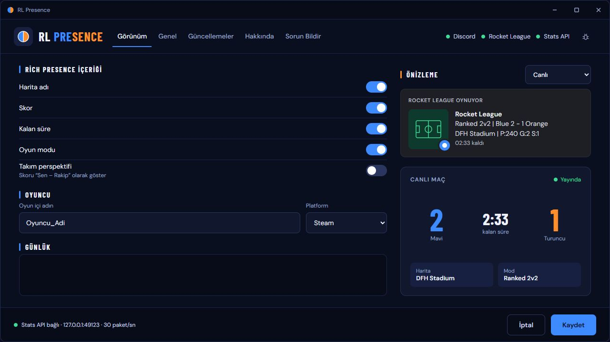

<p align="center">
  
</p>

<p align="center">
  Rocket League deneyimini Discord'a taşı.<br>
  <strong>Canlı maç bilgisi, harita görseli ve seçtiğin rank — tek bir sade aktivite kartında.</strong>
</p>

<p align="center">
  <a href="https://github.com/schwairex/RocketLeague-Presence/releases/latest/download/rl-presence.exe"></a>
</p>

<p align="center">
  <a href="README.md">English</a> ·
  <a href="#başlangıç">Başlangıç</a> ·
  <a href="https://github.com/schwairex/RocketLeague-Presence/releases">Sürüm notları</a> ·
  <a href="docs/usage.tr.md">Ayrıntılı rehber</a>
</p>

---

## Oyunun, tek bakışta

RL Presence, Rocket League'in **resmî yerel Stats API** verilerini okuyarak Discord Rich Presence'ı güncelleyen bir Windows uygulamasıdır. Oyun durumunu takip eder, maç bilgilerini bir arada gösterir ve oyun ya da Discord yeniden açıldığında bağlantısını yeniler.

<p align="center">
  
</p>

<p align="center"><sub>Örnek maç verileriyle masaüstü arayüzü. Discord görselleri için uygulamanın art assets'lerinin yüklenmiş olması gerekir.</sub></p>

| Maçın için | Günlük kullanım için |
| --- | --- |
| **Canlı maç bilgisi** — mod, harita, Mavi/Turuncu skor ve sonuç. | **Otomatik kurulum** — Steam ve Epic kurulumlarını bulur, Stats API'yi etkinleştirir. |
| **Senkron sayaç** — oyunda geri sayar; oyun saati durunca hareketli sayaç kaldırılır. | **İki dil** — Genel bölümünden Türkçe veya İngilizce seçebilirsin. |
| **Kendi istatistiklerin** — oyuncunu tanımladığında puan, gol ve kurtarış. | **Doğrulanan güncellemeler** — açılışta sürüm kontrolü, SHA-256 doğrulaması ve başarısız açılışta geri yükleme. |
| **Rank ikonu** — her desteklenen ranked mod için ayrı manuel rank ve küme. | **Uygulama içinden sorun bildirimi** — günlükleri veya hesap kimliklerini eklemeyen, diline uygun bir form. |

## Başlangıç

### 1. İndir ve aç

[Son sürümden](https://github.com/schwairex/RocketLeague-Presence/releases/latest) **`rl-presence.exe`** dosyasını indir ve yazılabilir bir klasöre koy. Önce **Discord masaüstü uygulamasını**, ardından RL Presence'ı aç.

**Gereksinimler:** Windows 10/11, Microsoft Edge WebView2 Runtime ve .NET Framework 4.8. EXE Python'ı içerir; Python kurmana veya kendi Discord uygulamanı oluşturmana gerek yoktur.

### 2. Rocket League'i uygulama yapılandırsın

Uygulama Steam kütüphanelerini ve Epic manifestlerini tarar, bulduğu kurulumları yapılandırır ve durumu gösterir. İki platform da yüklüyse çalışan oyunun EXE yolu aktif kurulumu belirler.

**Stats API ayarları değiştiyse Rocket League'i tamamen kapatıp yeniden aç.** Oyun bu ayarları açılışta okur. Kurulum bulunamıyorsa veya yazma izni yoksa Genel bölümünde ne yapman gerektiği açıklanır.

### 3. Kendine göre ayarla

**Görünüm** bölümüne Rocket League oyuncu adını ve platformunu gir. **Genel** bölümünden dilini seç, her ranked mod için rankını ve kümeni ayarla. Kaydet, bir maça gir ve RL Presence'ı açık tut.

> **Ranklar elle seçilir.** Resmî API rank, küme veya ayrıntılı menü/mağaza/sıra bilgisi sağlamaz. Bu aktiviteleri Genel'den seçebilirsin; canlı maç verileri önceliklidir.

## Küçük ikon. Oynadığın modun rankı.

**Ranked 1v1, 2v2, 3v3, Heatseeker, Rumble, Hoops, Snow Day ve Dropshot** için ayrı ranklar seç. Oynanan ranked mod kendi seçimini kullanır.

- **Büyük görsel** haritadır; üzerine gelince harita adı görünür.
- **Küçük görsel** seçtiğin ranktır; üzerine gelince **Diamond I Div IV** gibi rank/küme bilgisi görünür.
- Rank metni skor ve harita satırlarını kalabalıklaştırmaz. Casual, eğitim, Unranked ve rank kapalı seçimlerinde küçük ikon veya tooltip gönderilmez.

Görselleri sabit Discord uygulamasına geliştirici bir kez yükler. Son kullanıcıların görsel yüklemesi gerekmez. [Birebir harita ve rank anahtarları →](docs/art-assets.md)

### v0.2.6 ile istatistikler ön planda

**Rocket League**

```text
Ranked 2v2 • 🔵 5 - 2 🟠
⚽1  🧤2  ⭐593
```

⚽ gol · 🧤 kurtarış · ⭐ puan. Ranked ve casual kartlarında ikinci satır yalnızca kendi istatistiklerindir; harita adı büyük görselin tooltip’inde kalır. Casual gerçek mod adını kullanır, küçük ikon göstermez. Eğitimde **Training** ve harita adı bulunur; istatistik/küçük ikon yoktur. Canlı sayaç oyun sırasında korunur, oyun saati durunca kaldırılır ve kickoff ile devam eder; metne beyaz/sabit süre eklenmez. Kişisel istatistik değişiklikleri Discord’un gönderim bütçesi izin verdiğinde hemen iletilir. Değer **—** ise Görünüm’de oyun içi adını/platformunu doğru ayarla; eksik sayılar tahmin edilmez. [Sayaç ve gönderim sınırları →](docs/usage.tr.md#saat-maç-sonucu-ve-güncelleme-sınırı)

## Kullanımı kolay bir masaüstü arayüzü

<details>
<summary><strong>Güncellemeler ve Hakkında ekranlarını gör</strong></summary>

### Anlaşılır güncellemeler

Sürüm notları, indirme/doğrulama ilerlemesi ve önceki sürümler aynı yerde.


### Tutarlı bir tasarım

Her ekranda aynı koyu tema; boyutlandırılabilir pencere ve kaydırılabilir içerik.


Görseller v0.2.4 arayüzünü örnek durum verileriyle gösterir; gerçek sürüm bilgileri çalışma sırasında GitHub'dan alınır.

</details>

## Yardım mı gerekiyor?

| Gördüğün durum | Kontrol et |
| --- | --- |
| **Maç boyunca “In menus / Queueing” yazıyor** | Genel'den kurulum/API durumuna bak. INI değişikliğinden sonra Rocket League'i yeniden başlat. |
| **Kendi istatistiklerin görünmüyor** | Oyuncu adını/platformunu ayarla. Hesap değiştiriyorsan eski PrimaryId'yi temizle. |
| **Discord'da aktivite görünmüyor** | Masaüstü Discord'u aynı Windows oturumunda açık tut ve aktivite paylaşımını kontrol et. |
| **Harita veya rank ikonu eksik** | İlgili görselin Discord uygulamasının geliştiricisi tarafından yüklenmesi gerekir. |

Başka bir sorun için uygulamadaki **Sorun Bildir** sekmesini kullan. Rapor herkese açıktır: şifre veya kişisel bilgi yazma. [Hata ayıklama ve ayrıntılı kurulum →](docs/usage.tr.md#hata-ayıklama-ve-test)

## Kaynaktan çalıştır

Windows üzerinde Python **3.11+**:

```powershell
python -m venv .venv
.\.venv\Scripts\python.exe -m pip install -r requirements.txt
.\.venv\Scripts\python.exe run.py
```

Test veya tek EXE derlemek için:

```powershell
.\.venv\Scripts\python.exe -m pip install -r requirements-dev.txt
.\.venv\Scripts\python.exe -m pytest
.\build.ps1 -Python .\.venv\Scripts\python.exe
# Çıktı: dist\rl-presence.exe
```

## Düzenli dosya yapısı

```text
RocketLeague-Presence/
├── assets/                 # Logo, README görselleri ve ekran görüntüleri
├── docs/                   # Kullanım, geliştirme, sürüm ve asset rehberleri
│   ├── licenses/           # Üçüncü taraf font ve ikon bildirimleri
│   └── qa/                 # Doğrulama kayıtları ve eski ekran görüntüleri
├── rocket_league_rpc/      # Python uygulama modülleri
│   ├── ui/                 # EXE'ye eklenen HTML, JS, çeviri ve ikonlar
│   └── tests/              # Birim ve sahte sunucu entegrasyon testleri
├── run.py                  # Uygulamanın giriş noktası
├── build.ps1               # Windows tek EXE derleme betiği
├── config.example.json     # Örnek ayarlar; kişisel config yerelde kalır
├── requirements.txt
├── requirements-dev.txt
├── pyproject.toml
├── CHANGELOG.md
├── README.md
└── README.tr.md
```

Üretilen `dist/`, `build/`, `logs/`, `.venv/` ve kişisel `config.json` Git'e eklenmez. İndirilecek EXE dosyaları **GitHub Releases** bölümünde tutulur.

| İncele | Bağlantı |
| --- | --- |
| Kurulum, ayarlar ve API davranışı | [Türkçe rehber](docs/usage.tr.md) · [English guide](docs/usage.md) |
| Geliştirme ve modüllerin görevleri | [Geliştirme rehberi](docs/development.md) |
| Sürüm yayımlama ve otomatik güncelleme | [Release rehberi](docs/releasing.md) |
| Logo ve README'yi GitHub'a yükleme | [Yükleme rehberi](docs/github-upload.tr.md) |
| Discord harita ve rank görselleri | [Asset listesi](docs/art-assets.md) · [Rank anahtarları](docs/rank-asset-keys.txt) |
| Değişiklikler ve doğrulama | [Değişiklikler](CHANGELOG.md) · [v0.2.6 doğrulaması](docs/qa/verification.md) |

## RL Presence'ın arkasındaki ekip

| Geliştirici | Görevi |
| --- | --- |
| **[schwairex](https://github.com/schwairex)** | Founder · App Developer |
| **Nyris** | Co-Developer · QA |

Rocket League verileri [resmî Stats API](https://www.rocketleague.com/developer/stats-api) üzerinden alınır. Mod/harita eşleştirmeleri en iyi tahmindir; saat ve oyuncu kimliği sınırları ayrıntılı rehberde açıklanır. Üçüncü taraf bildirimleri: [fontlar](docs/licenses/fonts.txt) · [ikonlar](docs/licenses/icons.txt).

<p align="center"><sub>Projeyi beğendiysen bir yıldız, diğer Rocket League oyuncularının da keşfetmesine yardımcı olur.</sub></p>
